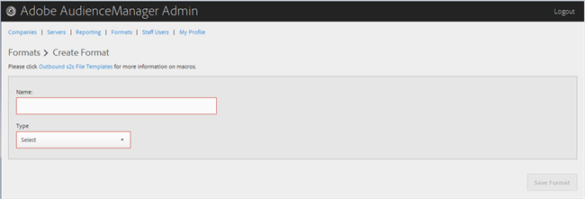

# Creare o modificare un formato {#create-or-edit-a-format}

Utilizzate la pagina [!UICONTROL Formats] nello strumento Amministrazione Audience Manager  per creare un nuovo formato o per modificare un formato esistente.

<!-- t_create_format.xml -->

>[!TIP]
>
>Quando si seleziona un formato per i dati non delimitati, è consigliabile, se possibile, riutilizzare un formato esistente. L&#39;utilizzo di un formato già collaudato garantisce la generazione dei dati in uscita. Per visualizzare esattamente la formattazione di un formato esistente, fate clic sull&#39;opzione [!UICONTROL Formats] nella barra dei menu e cercate il formato per nome o per numero di ID. I formati errati o le macro utilizzate nei formati forniranno un output formattato in modo errato o impediranno l&#39;output completo delle informazioni.

1. Per creare un nuovo formato, fare clic su **[!UICONTROL Formats]** > **[!UICONTROL Add Format]**. Per modificare un formato esistente, fate clic sul formato desiderato nella colonna **[!UICONTROL Name]**.

   

1. Compila i campi:
   * **Nome:** (obbligatorio) Specifica un nome descrittivo per il formato.
   * **Tipo:** (obbligatorio) Selezionare il formato desiderato:
      * **[!UICONTROL File]**: Invia i dati tramite  [!DNL FTP] file.
      * **[!UICONTROL HTTP]**: Racchiude i dati in un  [!DNL JSON] wrapper.

1. (Condizionale) Se si sceglie **[!UICONTROL File]**, compilare i campi:

   >[!NOTE]
   >
   >Per un elenco delle macro disponibili, vedere [Macro di formati file](../formats/file-formats.md#concept_A867101505074418A58DE325949E5089) e [Macros di formato HTTP](../formats/web-formats.md#reference_C392124A5F3F42E49F8AADDBA601ADFE).

   * **[!UICONTROL File Name]:** Specificare il nome del file per il trasferimento dei dati.
   * **Intestazione:** specificare il testo che viene visualizzato nella prima riga del file di trasferimento dati.
   * **[!UICONTROL Data Row]:** Specificate il testo che viene visualizzato in ciascuna riga esterna del file.
   * **[!UICONTROL Maximum File Size (In MB)]:** Specificate la dimensione massima del file per i file di trasferimento dati. I file compressi devono essere inferiori a 100 MB. Non esiste alcun limite per la dimensione del file non compresso.
   * **[!UICONTROL Compression]:** Selezionare il tipo di compressione desiderato: gz o zip per i file di dati. Per la distribuzione in [!UICONTROL AWS S3], è necessario utilizzare file .gz o non compressi.
   * **[!UICONTROL .info Receipt]:** Specifica che viene generato un file di controllo del trasferimento ([!DNL .info]). Il file [!DNL .info] fornisce informazioni sui metadati relativi ai trasferimenti di file in modo che i partner possano verificare che  Audience Manager gestisca correttamente i trasferimenti di file. Per ulteriori informazioni, vedere [Transfer-Control Files for Log File Transfers](https://marketing.adobe.com/resources/help/en_US/aam/c_s2s_add_transfer_control_files.html).
   * **[!UICONTROL MD5 Checksum Receipt]:** Specifica che viene generata una ricevuta  [!DNL MD5] checksum. La ricevuta [!DNL MD5] checksum in modo che i partner possano verificare che  Audience Manager abbia gestito correttamente l&#39;intero trasferimento.

1. (Condizionale) Se si sceglie **[!UICONTROL HTTP]**, compilare i campi:

   * **[!UICONTROL Method]:** Scegliere il  [!DNL API] metodo da utilizzare per il processo di trasferimento:
      * **[!UICONTROL POST]:** Se selezionate  [!DNL POST], selezionate il tipo di contenuto ([!DNL XML] o  [!DNL JSON]), quindi specificate il corpo della richiesta.
      * **[!UICONTROL GET]:** Se selezionate  [!DNL GET], specificate i parametri di query.

1. Fate clic su **[!UICONTROL Create]** se state creando un nuovo formato, oppure fate clic su **[!UICONTROL Save Updates]** se state modificando un formato esistente.

## Eliminare un formato {#delete-format}

1. Clic **[!UICONTROL Formats]**.
2. Fare clic su  nella colonna **[!UICONTROL Actions]** del formato desiderato.
3. Fare clic su **[!UICONTROL OK]** per confermare l&#39;eliminazione.
